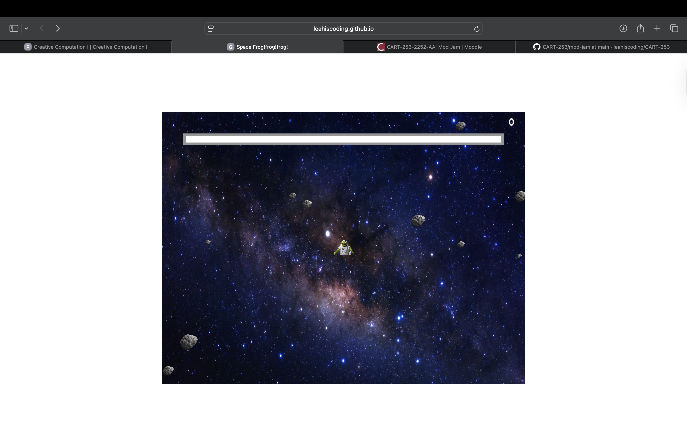

# Space Frog!Frog!Frog!

Leah Song

[View this project online](https://leahiscoding.github.io/CART-253/mod-jam/)

## Description

> Kermit is trapped in the space! To win this game you'll have to get rid of 15 asteroids (flies) in given time! If Kermit gets hit by the asteroids 10 times or cannot hit 15 asteroids in given time, the player will lose the game.
> The experience is controlled via spacebar and arrow keys. Player can move kermit using the arrow keys and shoot the laser using the spacebar.

> The project is meant to give the user a sense of escaping the space and getting rid of the asteroids. I replaced flies to asteroids to emulate the feeling of space.

## Screenshot(s)

This bit should have some images of the program running so that the reader has a sense of what it looks like. For example:

> 

## Attribution

This bit should attribute any code, assets or other elements used taken from other sources. For example:

> - This project uses [p5.js](https://p5js.org).
> - The Kermit images are from wallpapers.com (https://wallpapers.com/png/kermit-in-space-png-wqe70-gre1rb1xk85fu1fo.html)
> - The Space image is from Natural History Museum (https://www.nhm.ac.uk/discover/what-is-space.html)
> - I used ChatGPT to generate the picture of an asteroid (https://chatgpt.com/)
> - I used genAI (ChatGPT, Gemini, and in-built Copliot) to troubleshoot my code. (https://chatgpt.com) (https://gemini.google.com/app)
> - I used Adobe Illustrator to create the laser image.
> - I used Jason Erdreich's Creating a Retro-Style Platform Game in P5.js (https://www.youtube.com/playlist?list=PLBDInqUM5B26FjwMMZqGDxqQr1kX5V9Ul) and Creating a Space Invaders Inspired Video Game in P5.js (https://www.youtube.com/playlist?list=PLBDInqUM5B25FzygoJ9Ifg1TZXmIHz4zh) as a reference. (inspiration + reference)
> -  I'm not too sure if it's allowed, but for the progressbar, I used a classmate's work as a reference. (https://ray-ux514.github.io/ConcordiaRepository/Topics/ModJamFinal/) (inspiration + reference)

## License

> This project is licensed under a Creative Commons Attribution ([CC BY 4.0](https://creativecommons.org/licenses/by/4.0/deed.en)) license with the exception of libraries and other components with their own licenses.