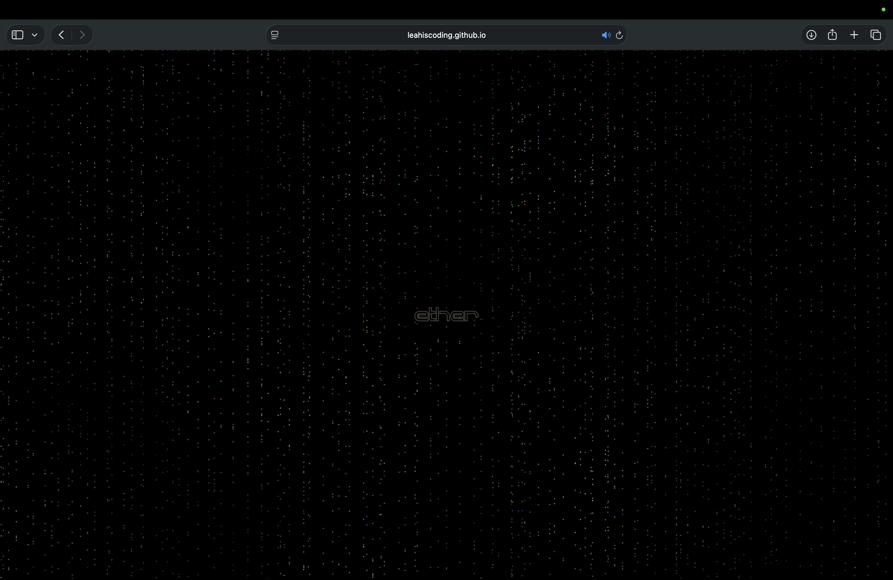

# Ether

Leah Song

[View this project online]
(https://leahiscoding.github.io/CART-253/variation-jam/)

## Description

> *Ether* is a cybe world experience that allows the user to experience three different stages of the world

> The experience is controlled both via buttons and enter

> Once you enter Ether, there are three different sections. If you press 1 or click one third of the screen, that will bring you to the "screen.html". You can press A to take a picture of the screen. If you press 2 or click the middle third of the screen, that will bring you to the "text.html", which grants you a wish. If you press 3 or click the last third of the screen, that will bring you to "last.html", which is a variation from the frog frog frog game. If you press 1,2, and 3 in each HTML, it will bring you back to the "ether.html" screen. 

> The project is meant to give the user confusion and allows the user to explore the hidden function.

## Screenshot(s)

> 

## Attribution

This bit should attribute any code, assets or other elements used taken from other sources. For example:

> - This project uses [p5.js](https://p5js.org).
> - https://stackoverflow.com/questions/58477636/transitioning-from-one-scene-to-the-next-with-p5-js > reference for a scene translation code
> - https://caglrc.cc/glasstty/ > font for loading screen
> - https://editor.p5js.org/pippinbarr/sketches/bjxEfpiwS > typerwriter effect reference
> - https://editor.p5js.org/pphoebelemonn/sketches/Q2o88Dgos > typerwriter effect reference
> - https://editor.p5js.org/xc2736/sketches/1igkPpfX5 >typewriter effect reference
> - https://creative-coding.decontextualize.com/text-and-type/ > text and type reference
> - https://www.gorillasun.de/blog/an-introduction-to-perlin-noise-in-p5js-and-processing/ > perlin noise reference for ether background
> - https://editor.p5js.org/codingtrain/sketches/KTVfEcpWx > ASCII images tutorial from the coding train
> - https://www.youtube.com/watch?v=55iwMYv8tGI > > ASCII images tutorial from the coding train (video)
> - https://www.youtube.com/watch?v=3pI3SQjfVyA > reference code for text.html
> - https://www.youtube.com/watch?v=jtseHw2Trw8 > reference code for index.html
> - https://freemusicarchive.org/music/Meydan/Ambient_1860/Freezing_but_warm/ > music for ether.html
> - https://editor.p5js.org/p5/sketches/Sound:_Load_and_Play_Sound > playing music reference
> - https://pixabay.com/sound-effects/camera-shutter-314056/ > camera shutter sound 
> - https://editor.p5js.org/ywang@gsadigitalculture.com/sketches/uczPqdDlp > music play button reference (I didn't end up using it, but I still found it helpful)
> - https://freemusicarchive.org/music/mark-lingard/dark-ambience/soon-i-used-to-be-here-now-dark-ambience/ > music for text.html
> - https://www.nasa.gov/stem-content/new-education-resources-peanuts-and-nasa-a-50th-anniversary-celebration/ > snoopy picture for last.html
> - https://www.pngaaa.com/detail/502740 > snoopy picture for last.html
> - https://pixabay.com/sound-effects/laser-shot-ingame-230500/ > laser sound for last.html
> - https://pixabay.com/sound-effects/space-72679/ > space sound for last.html

## License

This bit should include the license you want to apply to your work. For example:

> This project is licensed under a Creative Commons Attribution ([CC BY 4.0](https://creativecommons.org/licenses/by/4.0/deed.en)) license with the exception of libraries and other components with their own licenses.